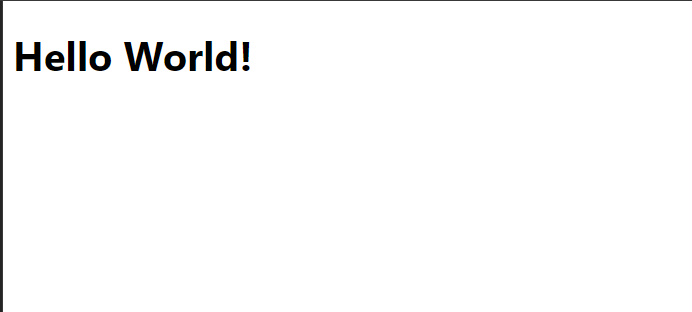

# The Progressive JavaScript Framework

## what

from their website:
> Vue (pronounced /vjuː/, like view) is a JavaScript framework for building user interfaces. It builds on top of standard HTML, CSS, and JavaScript and provides a declarative and component-based programming model that helps you efficiently develop user interfaces, be they simple or complex.

some terms from above paragraph to understand:

1. declarative: this refers to what we want to achieve rather than how, example, we want the button here a text there; rest is taken care of
2. component based: similar to reactjs; break down each reusable parts of ui into components

## why

- Vue lets you forget about DOM and separate the view from the model easily. Instead of upgrading DOM nodes imperatively it's your model that defines the rendered output. Vue template engine makes it easy to render HTML based on that model.

- Vue lets you forget about rendering. Thanks to its reactivity templates update automatically when your data model changes.

- vue makes encapsulation easier thanks to its modular nature

## how 

```jsx
<!--
Say Hello World with Vue!
-->

<script setup>
import { ref } from 'vue'
const message = ref('Hello World!')
</script>

<template>
  <h1>{{ message }}</h1>
</template>
```
